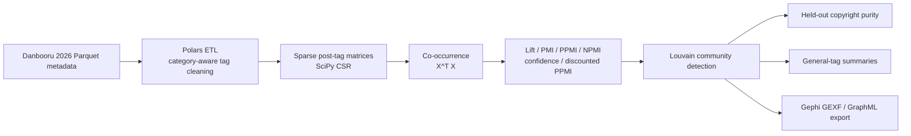

# Unsupervised Ontology Reconstruction from Danbooru Meta-tags using Discounted NPMI

This project mines the Danbooru 2026 metadata corpus to reconstruct fandom
ontologies from tags alone. It uses no images and no supervised copyright labels
during graph construction: posts are treated as transactions, tags as items, and
the resulting sparse co-occurrence graph is scored with robust association
metrics before Louvain community detection.

The result is a research case study that combines data engineering,
statistical NLP, graph mining, and a practical path toward AI drawing prompt
recommendation.

## Why This Matters

User-generated tag systems are noisy, redundant, and long-tailed. Yet their
co-occurrence structure contains a surprisingly rich ontology: characters from
the same franchise cluster together, event costumes form micro-communities, and
visual motifs emerge as high-information general tags.

This project demonstrates that a fully unsupervised pipeline can recover that
structure at Danbooru scale.

## Pipeline



## Key Results

| Experiment | Result |
| --- | ---: |
| Character vocabulary after filtering | 28,682 tags |
| Character-character scored edges | 837,806 |
| Baseline communities | 950 |
| Baseline mean copyright purity | 0.953 |
| Baseline median copyright purity | 1.000 |
| Baseline communities with purity >= 0.9 | 87.8% |
| Blue Archive community purity | 0.984 |

Community detection used only character-character topology. Copyright labels
were held out and used afterward for evaluation.

| Community run | Mean purity | Median purity | Purity >= 0.9 |
| --- | ---: | ---: | ---: |
| baseline: `npmi>=0.15`, `co>=15`, `resolution=1.2` | 0.953 | 1.000 | 87.8% |
| strict: `npmi>=0.50`, `co>=25`, `resolution=1.2` | 0.967 | 1.000 | 90.7% |
| fine: `npmi>=0.60`, `co>=25`, `resolution=1.5` | 0.968 | 1.000 | 90.2% |

## Case Study: Blue Archive

The baseline run places `asuna_(blue_archive)`, `karin_(blue_archive)`,
`neru_(blue_archive)`, `akane_(blue_archive)`, and `toki_(blue_archive)` into
the same community.

```text
community_id: 12
size: 377
dominant held-out copyright: blue_archive
blue_archive members: 371
purity: 0.984
```

Under stricter thresholds, the broad IP-level cluster decomposes into event and
subgroup motifs. A C&C-like subcluster contains Akane/Karin/Neru/Toki/Asuna
variants and is explained by high-information general tags such as:

```text
cleaning_&_clearing_(blue_archive)
sukajan
aqua_leotard
sig_mpx
```

This is the graph-theoretic version of prompt context: broad thresholds recover
franchise boundaries; strict thresholds recover style packs, event costumes, and
co-drawn micro-motifs.

## Engineering Highlights

- Polars lazy ETL for 10.6M Danbooru posts.
- Category-aware tag cleaning to prevent null/empty-string contamination.
- SciPy CSR matrices and `X.T @ X` for sparse co-occurrence without a quadratic
  DataFrame self-join.
- Robust association scoring: Lift, PMI, PPMI, NPMI, directional confidence,
  and discounted PPMI.
- NetworkX Louvain communities with deterministic seeds.
- Held-out copyright purity evaluation.
- Gephi-ready GEXF/GraphML export for network visualization.

## Quickstart

```powershell
python -m pip install -e ".[dev]"
python -m pytest -q
```

Download the Danbooru 2026 Parquet metadata into `data/raw/danbooru-2026/`.
Large raw and generated data files are intentionally ignored by git.

```powershell
danbooru-graph prepare-vocab --input data/raw/danbooru-2026 --out data/processed --categories character
danbooru-graph build-edges --processed data/processed --pair character-character --min-pair-count 5
danbooru-graph score-edges --processed data/processed --pair character-character --discount-k 10 --sort-by discounted_ppmi --top-k 50
```

Detect communities and evaluate them against held-out copyright labels:

```powershell
danbooru-graph detect-communities --processed data/processed --min-npmi 0.15 --min-co-count 15 --resolution 1.2
danbooru-graph build-copyright-profile --input data/raw/danbooru-2026 --out data/processed/evaluation
danbooru-graph evaluate-purity --communities data/processed/communities/character_communities_npmi0.15_co15_res1.2.json --profile data/processed/evaluation/character_copyright_profile.parquet
```

Export a Gephi visualization:

```powershell
danbooru-graph export-community-graph `
  --edges data/processed/edges_character_character.parquet `
  --communities data/processed/communities/character_communities_npmi0.15_co15_res1.2.json `
  --community-id 12 `
  --out data/processed/visualization/blue_archive_community12.gexf
```

## Industrial Application: Prompt Recommendation

The offline graph can power a prompt recommendation system for text-to-image
models:

- Confidence autocomplete: `P(Y|X)` recommends canonical character traits.
- Discounted PPMI exploration: high-information tags avoid generic stop-words.
- Community motif injection: detected communities become reusable style packs.
- Future embedding layer: Node2Vec or random-walk Skip-gram can generalize
  beyond directly observed co-occurrences and serve nearest-neighbor search via
  FAISS.

See [docs/prompt_recommendation.md](docs/prompt_recommendation.md) for the
application design.

Local recommendation demo:

```powershell
danbooru-graph recommend-tags --tags "asuna_(blue_archive),neru_(blue_archive)" --target-category character --top-k 10
danbooru-graph recommend-tags --tags "asuna_(school_uniform)_(blue_archive),neru_(blue_archive)" --target-category general --top-k 10
```

## Documentation

- [Architecture](docs/architecture.md)
- [Prompt recommendation design](docs/prompt_recommendation.md)
- [Reproducibility guide](docs/reproducibility.md)
- [Phase 4 semantic topology report](reports/phase4_semantic_topology.md)
- [Research outline](reports/research_outline.md)

## License

MIT
