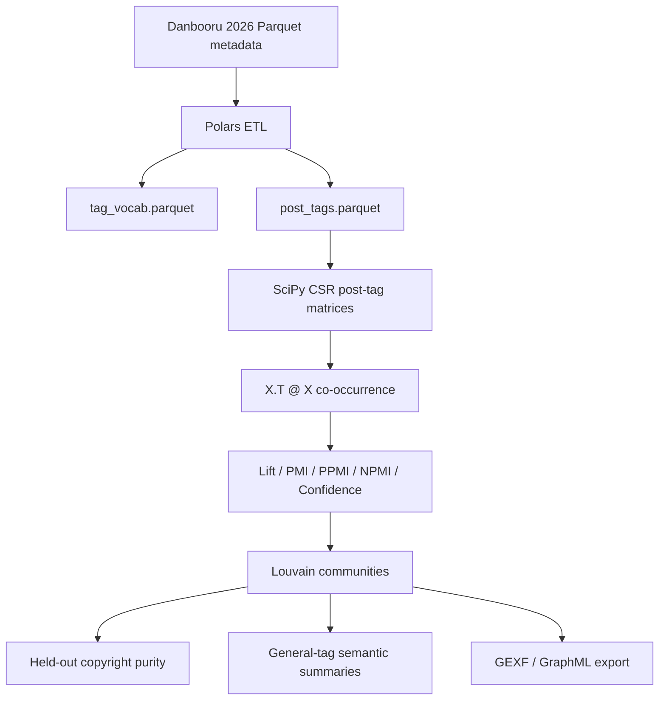

# Architecture

## Offline Research Pipeline



The critical engineering move is to avoid a full relational self-join over all
post tags. Instead, each category becomes a sparse post-tag matrix:

```text
X[post_idx, tag_id] = 1
C = X.T @ X
C[i, j] = number of posts where tag_i and tag_j co-occur
```

This makes million-edge graph construction practical on a local workstation.

## Data Layout

Generated data is intentionally not tracked by git.

```text
data/
  raw/danbooru-2026/                 # downloaded Parquet shards
  processed/
    posts.parquet
    tag_vocab.parquet
    post_tags.parquet
    edges_character_character.parquet
    communities/
    evaluation/
    visualization/
```

## Online Application Architecture

The research output can be deployed as precomputed recommendation tables:


The online service is read-heavy. Since filtered graph tables are modest in
size, they can be held in memory or loaded into Redis sorted sets.

Example Redis layout:

```text
tag:karin_(blue_archive):related:general
  dark-skinned_female -> confidence or discounted_ppmi
  halo -> confidence or discounted_ppmi

tag:asuna_(blue_archive):related:character
  karin_(blue_archive) -> discounted_ppmi
  neru_(blue_archive) -> discounted_ppmi

community:234:general
  cleaning_&_clearing_(blue_archive) -> score
  sukajan -> score
  sig_mpx -> score
```

## Deployment Boundary

This repository implements the offline research and export pipeline. It does
not ship a production FastAPI or Redis service; the application design is
documented as an application extension.
